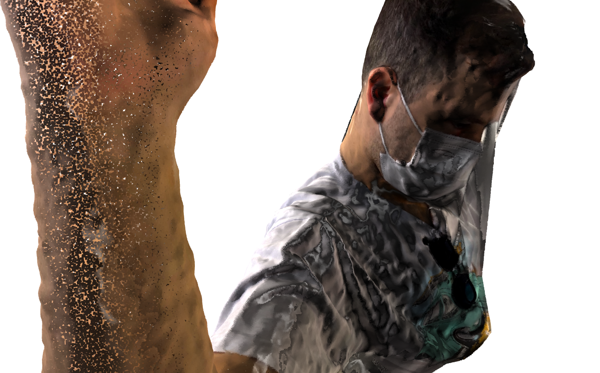
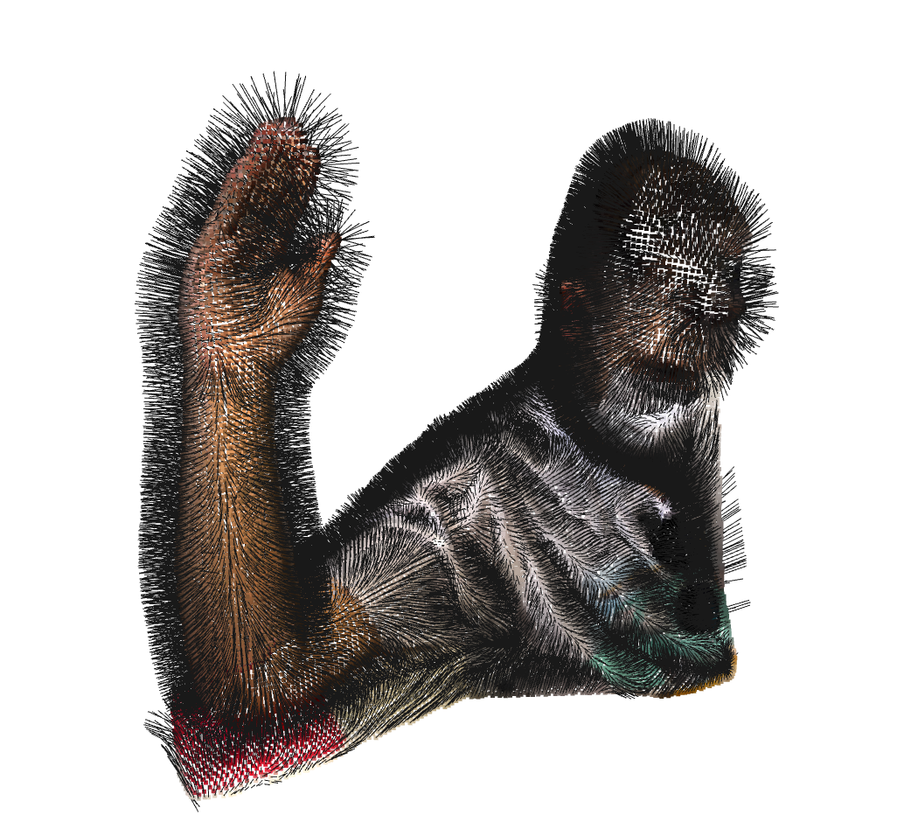
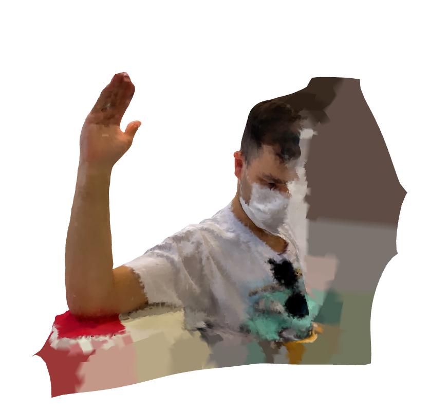
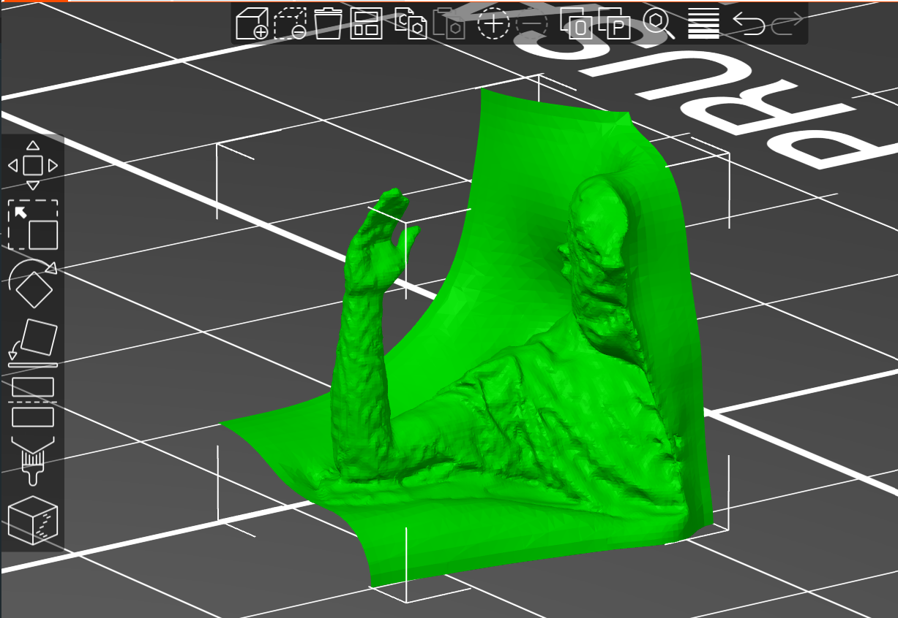

# Point-Cloud-Mesh-Generation
This project is focused on creating a 3D mesh surface from a point cloud obtained from a 3D scan taken on an iPhone 13 using the Polycam app. The point cloud is then processed using the Poisson's surface reconstruction algorithm provided by the Open3D library, which generates a smooth and watertight mesh surface. The final output is saved as a .stl file, which can be used for 3D printing, visualization, or further processing. This project demonstrates the use of state-of-the-art 3D scanning and reconstruction techniques to create high-quality 3D models from mobile devices, and it is implemented in python.

### PointCloud Visualization
 

### Downsampled Point Cloud
 

### Vertex Normal Estimation

### Poisson Surface Reconstruction

### Saved .stl file
